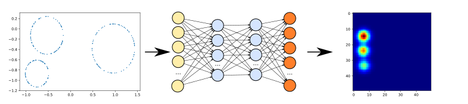
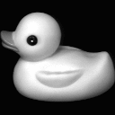

# Generate PI with NN
This repository contains the code I have developed during my internship at DataShape.
The goal was to build a neural network that could predict a persistence image from a point cloud.

  
The repository is divided in several folders and files, the detail is listed below.

 List of the different notebooks
---

- **Training of the NN**

   This folder contains the notebooks used for the training of the NN that generates PI.
   1.  [`Training_of_the_NN_for_dynamical_systems`](Training_of_the_NN/Training_of_the_NN_for_dynamical_systems.ipynb) is the definition and the training of the NN that predicts PI for the dynamical systems.
   2. [`Training of the NN for multiple circles`](Training_of_the_NN/Training_of_the_NN_for_multiple_circles.ipynb) is the definition and the training of the NN that predicts PI for the multiple circle dataset.
   3. [`Training of the NN for one smaller circle`](Training_of_the_NN/Training_of_the_NN_for_one_smaller_circle.ipynb) is the definition and the training of the NN that predicts PI for the dataset with only one circle.
   4. [`Training of the NN for the torus`](Training_of_the_NN/Training_of_the_NN_for_the_torus.ipynb) is the definition and the training of the NN that predicts PI for the dataset with the torus.
   5. [`Training of the NN for embedded data in higher dimension`](Training_of_the_NN/Training_of_the_NN_for_embedded_data_in_higher_dimension.ipynb) is the definition and the training of the NN that predicts PI for the embedded in higher dimension dataset. (4d using the Whitney embedding and 10d using a matrix multiplication).

- **Study of the results of the NN**

  This folder contains the notebooks used to study the NN trained on different dataset, by doing some statistical tests or classification and regression.
  1. [`MMD test on all datasets`](Study_of_the_results_of_the_NN/MMD_test_on_all_datasets.ipynb) is the notebook used to compute the MMD test on each NN and to have the p-value of this test.
  2. [`Study of the results of the NN for dynamical system`](Study_of_the_results_of_the_NN/Study_of_the_results_of_the_NN_for_dynamical_system.ipynb) is the notebook used to compute the classification results and the KS test for the NN trained on dynamical systems.  
  3. [`Study of the results of the NN for multiple circles`](Study_of_the_results_of_the_NN/Study_of_the_results_of_the_NN_for_multiple_circles.ipynb) is the notebook used to compute the classification results and the KS test for the NN trained on the multiple circles dataset.
  4. [`Study of the results of the NN for multiple noisy circles`](Study_of_the_results_of_the_NN/Study_of_the_results_of_the_NN_for_multiple_noisy_circles.ipynb) is the notebook used to compute the classification results and the KS test for the NN trained on the multiple noisy circles dataset using the DTM filtration.
  5. [`Study of the results of the NN for one noisy circle`](Study_of_the_results_of_the_NN/Study_of_the_results_of_the_NN_for_one_noisy_circle.ipynb) is the notebook used to compute the regression results and the KS test for the NN trained on the one  noisy circle dataset.
  6. [`Study of the results of the NN for one smaller circle`](Study_of_the_results_of_the_NN/Study_of_the_results_of_the_NN_for_one_smaller_circle.ipynb) is the notebook used to compute the regression results and the KS test for the NN trained on the one smaller circle dataset.
  7. [`Study of the results of the NN for the sphere`](Study_of_the_results_of_the_NN/Study_of_the_results_of_the_NN_for_the_sphere.ipynb) is the notebook used to compute the regression results and the KS test for the NN trained on the one sphere dataset.
  8. [`Study of the results of the NN for the torus`](Study_of_the_results_of_the_NN/Study_of_the_results_of_the_NN_for_the_torus.ipynb) is the notebook used to compute the regression results and the KS test for the NN trained on the one torus dataset.

- **Datasets**

  This folder contains the Python scripts that have been used to generated the data used for the training and testing of the NN. The folder [`COIL's duck`](Datasets/COILs_duck/) are the images of the duck used in this [VAE](Training_of_the_VAE/VAE_for_COILs_duck.ipynb).

- **Training of the VAE**
    1. [`VAE for smaller circles`](Training_of_the_VAE/VAE_fo_Smaller_Circles.ipynb) is the definition and the training of the VAE that predicts PI and densities for the smaller circles dataset.
    2. [`VAE for COIL's duck`](Training_of_the_VAE/VAE_for_COILs_duck.ipynb) is the definition and the training of the VAE that predicts PI and images for the rotating duck dataset.
    3. [`VAE for multiple circles`](Training_of_the_VAE/VAE_for_Multiple_Circles.ipynb) is the definition and the training of the VAE that predicts PI and densities for the multiple circles dataset.
    4. [`VAE for squares or circles`](Training_of_the_VAE/VAE_for_Squares_and_Circles.ipynb) is the definition and the training of the VAE that predicts PI and densities for the squares or circles dataset.

- **Study of the results of the VAE**
  1. [`Study of the results of the VAE for Multiple Circles`](Study_of_the_results_of_the_VAE/Study_of_the_results_of_the_VAE_for_Multiple_Circles.ipynb) is the study of the VAE trained for the multiple circle dataset. We study the results of this VAE ans it's latent distribution.
  2. [`Study of the results of the VAE for Smaller Circles`](Study_of_the_results_of_the_VAE/Study_of_the_results_of_the_VAE_for_Smaller_Circles.ipynb) is the study of the VAE trained for the smaller circle dataset. We study the results of this VAE ans it's latent distribution.
  3. [`Study of the results of the VAE for square or circle`](Study_of_the_results_of_the_VAE/Study_of_the_results_of_the_VAE_for_squares_and_circles.ipynb) is the study of the VAE trained for the square or circle dataset. We study the results of this VAE ans it's latent distribution.
  4. [`Study of the results of the VAE for the duck`](Study_of_the_results_of_the_VAE/Study_of_the_results_of_the_VAE_for_the_duck.ipynb) is the study of the VAE trained for COILs duck dataset. We study the results of this VAE ans it's latent distribution.
  

